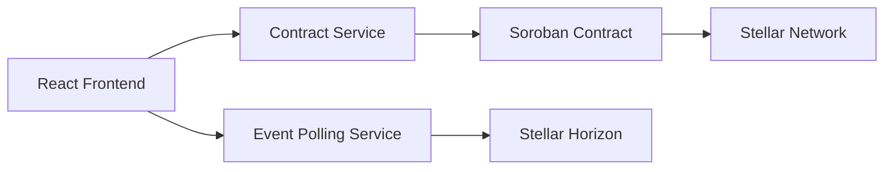

# Final Submission Report

## CI/CD Status

- GitHub Actions workflow exists at `.github/workflows/ci.yml`.
- Workflow runs on `push` and `pull_request`.
- Frontend CI job installs dependencies, runs tests, runs linting, and builds the Vite production bundle.
- Contract CI job runs Rust/Soroban contract tests with `cargo test`.
- The pipeline is configured to fail when any required build, lint, or test command fails.

## Tests Passing

Local verification completed:

- `npm run build` passed.
- `npm test` passed.
- `npm run lint` passed.
- `cargo test` passed.

Current automated test coverage includes:

- Navbar branding and navigation rendering.
- Wallet connect button rendering.
- Landing page CTA rendering.
- ErrorBoundary fallback UI rendering.
- Soroban contract tests for initialization, remittance creation, fee calculation, completion, refund, history, validation, and rate limiting.

## Responsiveness Improvements

- Chakra UI responsive props are used across the main frontend pages.
- Navbar supports desktop navigation and mobile menu behavior.
- Landing page uses responsive grid layout and mobile-friendly spacing.
- Send Money, Faucet, Swap, History, and Documentation pages use responsive containers and touch-friendly controls.
- The UI uses a dark glassmorphism design system with clearer spacing, larger controls, and improved hierarchy for mobile usage.

## Event Streaming Implementation

- Real-time frontend updates are implemented through polling in `frontend/src/services/events.ts`.
- The event service polls Stellar Horizon every 10 seconds for connected wallet operations.
- Payment and path-payment operations are normalized into transaction records.
- History refreshes automatically when new operations are detected.
- Wallet balances refresh after transaction sync.
- The UI displays syncing states and notifies users when new transactions are found.
- Polling is used for browser-compatible reliability when websocket support is unavailable.

## Architecture Overview

Stellarama is organized as a frontend, smart contract, and deployment/tooling workspace.

- `frontend/` contains the React, TypeScript, Vite, and Chakra UI app.
- `contract/` contains the Rust/Soroban smart contract and contract tests.
- `scripts/` contains testnet setup and deployment helpers.
- `.github/workflows/ci.yml` contains automated CI checks.
- `vercel.json` configures Vercel deployment from the repository root into `frontend/dist`.

High-level flow:

Submission placeholders still to fill:

- Contract Address: TODO: Add deployed contract address
- Transaction Hash: TODO: Add transaction hash
- Demo Video: TODO: Add demo video link
