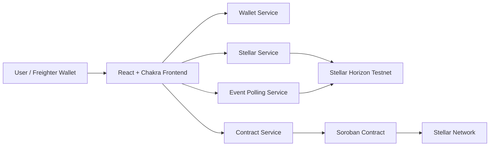

# Stellarama

[](https://github.com/shainooo/Stellarama/actions/workflows/ci.yml)

## Overview

Stellarama is a Stellar-based remittance application for sending money across borders with a wallet-first Web3 experience. The project combines a React frontend, Stellar/Freighter wallet integration, Horizon-based transaction monitoring, and a Soroban smart contract that records remittance lifecycle data.

The product flow focuses on the Gulf-to-India remittance corridor:

- Users connect a Freighter wallet.
- Users simulate a bank deposit flow to receive testnet funds.
- Users send funds through Stellar path payments.
- Users can review transaction history and export proof-of-remittance records.
- The frontend polls Stellar Horizon for real-time transaction updates.

## Features

- Futuristic dark Web3 interface with Chakra UI.
- Freighter wallet connection.
- Send Money page for path-payment remittance flow.
- Faucet page for bank-deposit simulation.
- Swap page for token conversion flows.
- History page with synced transaction records and PDF export.
- Documentation page explaining the user flow.
- ErrorBoundary fallback UI for frontend resilience.
- Event polling every 10 seconds for wallet transaction updates.
- Automated frontend tests, frontend build, linting, and contract tests in CI.

## Architecture



Primary frontend modules:

- `frontend/src/App.tsx` wires routes and providers.
- `frontend/src/components/Navbar.tsx` provides navigation and wallet entry.
- `frontend/src/pages/Landing.tsx` provides the landing experience.
- `frontend/src/pages/SendMoney.tsx` handles the remittance send flow.
- `frontend/src/pages/Faucet.tsx` handles the bank-deposit simulation.
- `frontend/src/pages/Swap.tsx` handles token swap flows.
- `frontend/src/pages/History.tsx` displays transaction history and exports receipts.
- `frontend/src/services/events.ts` polls Horizon for account activity.
- `frontend/src/services/wallet.ts` handles Freighter wallet access.
- `frontend/src/services/stellar.ts` handles Horizon path-payment operations.
- `frontend/src/services/contract.ts` prepares Soroban contract calls.

## Smart Contract Architecture

The Soroban contract lives in `contract/src/lib.rs`.

Contract responsibilities:

- Initialize contract admin.
- Create remittance records.
- Calculate a 0.5% platform fee.
- Store sender, recipient, amount, token, status, and timestamp.
- Complete pending remittances.
- Refund failed remittances.
- Track user remittance statistics.
- Return user history and user stats.
- Emit lifecycle events for created, completed, and refunded remittances.

Core contract methods:

- `initialize`
- `create_remittance`
- `complete_remittance`
- `refund_remittance`
- `calculate_fee`
- `get_remittance`
- `get_user_history`
- `get_user_stats`

## Inter-Contract Communication

Frontend -> Contract Service -> Soroban Contract -> Stellar Network

The frontend calls service modules instead of speaking directly to every Stellar primitive from UI components.

1. UI pages collect user input and wallet state.
2. `contract.ts` builds Soroban contract invocations.
3. Freighter signs the transaction XDR.
4. The signed transaction is submitted to the Stellar testnet.
5. The Soroban contract stores remittance state and emits lifecycle events.
6. Horizon exposes account operations and transaction history back to the frontend.

The contract also communicates with Stellar Asset Contract interfaces through `soroban_sdk::token::Client` when escrow transfers are required.

## Event Streaming & Real-Time Updates

The frontend implements a polling-based real-time update system in `frontend/src/services/events.ts`.

- Polls Stellar Horizon every 10 seconds.
- Normalizes payment and path-payment operations into frontend transaction records.
- Refreshes transaction history when new operations are detected.
- Refreshes wallet balances after new transactions sync.
- Shows syncing indicators while updates are being fetched.
- Shows in-app notifications when new transactions are detected.

Polling is used because it is reliable in browser deployments and does not require websocket support.

## Tech Stack

Frontend:

- React
- TypeScript
- Vite
- Chakra UI
- Framer Motion
- React Router
- React Icons
- Freighter API
- Stellar SDK
- Vitest
- React Testing Library

Smart contract:

- Rust
- Soroban SDK
- Stellar testnet

Tooling and deployment:

- GitHub Actions
- Vercel
- ESLint
- npm
- Cargo

## Mobile Responsiveness

The frontend uses Chakra UI responsive props across the main app surfaces.

Mobile-focused behavior includes:

- Responsive Navbar with a mobile menu.
- Responsive landing page layout.
- Single-column mobile layouts for forms and cards.
- Touch-friendly buttons and form controls.
- Flexible spacing across Landing, Send Money, Faucet, Swap, History, and Documentation pages.

## Testing

Frontend tests use Vitest and React Testing Library.

Run frontend tests:

```bash
cd frontend
npm test
```

Current frontend test coverage includes:

- Navbar branding and navigation.
- Wallet connect button rendering.
- Landing page CTA rendering.
- ErrorBoundary fallback UI.

Run contract tests:

```bash
cd contract
cargo test
```

## CI/CD Pipeline

GitHub Actions workflow: `.github/workflows/ci.yml`

The workflow runs on:

- `push`
- `pull_request`

Pipeline jobs:

- Install frontend dependencies.
- Run frontend tests.
- Run frontend linting.
- Build the frontend.
- Run Soroban contract tests.

The workflow fails if any build, lint, or test step fails.

## Setup

Install frontend dependencies:

```bash
cd frontend
npm install
```

Start local frontend:

```bash
npm run dev
```

Build frontend:

```bash
npm run build
```

Run frontend tests:

```bash
npm test
```

Run contract tests:

```bash
cd ../contract
cargo test
```

## Deployment Workflow

Frontend deployment is configured for Vercel from the repository root.

Vercel config:

- `vercel.json`
- Install command: `cd frontend && npm ci`
- Build command: `cd frontend && npm run build`
- Output directory: `frontend/dist`
- SPA rewrite to `index.html`

Contract deployment scripts are in `scripts/`.

## Contract Address

TODO: Add deployed contract address

## Transaction Hash

TODO: Add transaction hash

## Live Demo

https://stellarama.vercel.app/

## Screenshots

Screenshots are stored in `screenshots/`.

- `screenshots/BankDeposit.png`
- `screenshots/Tx history.png`
- `screenshots/docs.png`

## Demo Video

TODO: Add demo video link

## Future Improvements

- Replace polling with streaming where websocket support is available.
- Add broader form validation coverage.
- Add end-to-end browser tests.
- Add more contract integration tests around token escrow paths.
- Add production asset configuration documentation.
- Add deployment environment variable documentation.
- Add richer analytics for remittance volume and completion rates.
